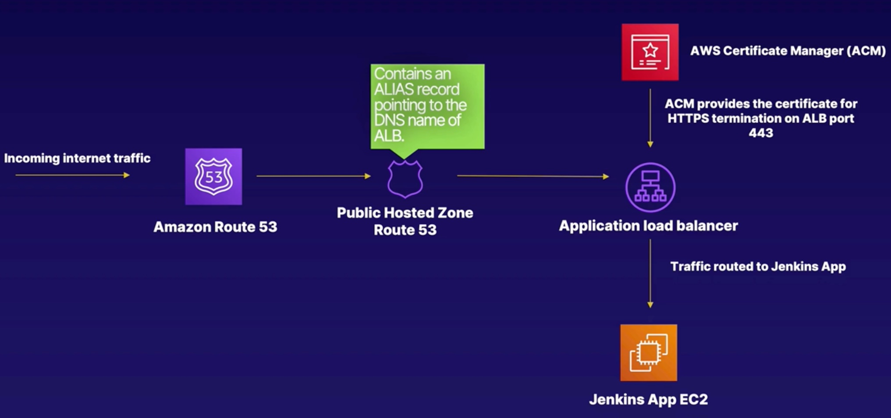

# DNS: Setting up HTTPS and Route53 Record



```shell
aws --profile acloudguru route53 list-hosted-zones

{
    "HostedZones": [
        {
            "Id": "/hostedzone/Z032126926D61M30W9YFI",
            "Name": "cmcloudlab1625.info.",
            "CallerReference": "ec2c96e5-ec3b-45f5-bb48-d04610c1975f",
            "Config": {
                "Comment": "",
                "PrivateZone": false
            },
            "ResourceRecordSetCount": 2
        }
    ]
}
```

Follow along by looking at [dns.tf](../terraform/dns.tf) and [acm.rf](../terraform/acm.tf) for configuration of https certification.