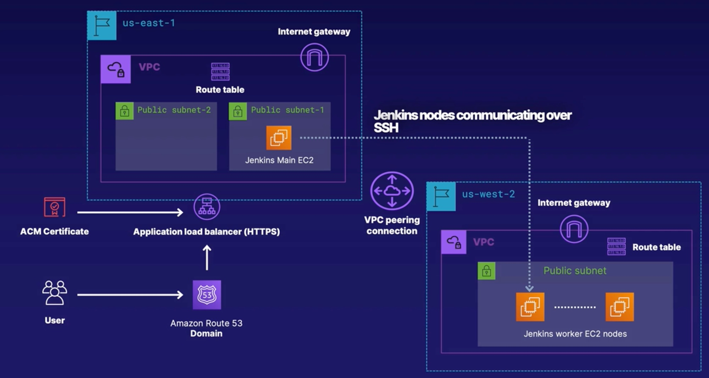

# Introduction

Terraform:
- Purpose built for infrastructure automation and cloud agnostic (i.e. not tied to any cloud provider); works across all popular cloud providers (AWS/GCP/Azure).
- Easy to write declarative templates in HCL (Hashicorp Configuration Language).
- Keeps track of infrastructure through local or remote state files; user must back up the state file.
- Offers built-in functions and a vast array of modules and providers for working with cloud and on-prem systems.
- Agentless; only requires a self-contained Terraform binary on your system.

CloudFormation:
- IaC for AWS.
- Templates in JSON and YAML.
- Keeps track of deployment by itself i.e. user does not need to worry.
- Declarative.
- Offers built-in functions and cross organisation deployments.
- Agentless; service lives in the AWS cloud.

Ansible:
- A hybrid configuration management and infrastructure deployment tool; popular for configuration management.
- Ansible playbooks are written in YAML.
- Does not keep track of state of infrastructure deployment like CloudFormation and Terraform.
- Offers both procedural (ad-hoc tasks, playbooks) and declarative modules (AWS etc.).
- Offers a vast array of modules for most OS-level utilities as well as cloud and on-prem infrastructure vendors.
- Agentless, accesses infrastructure APIs for infr deployment and SSH for OS configuration management.

We will build a distributed, multi-region, Jenkins CI/CD deployement:
